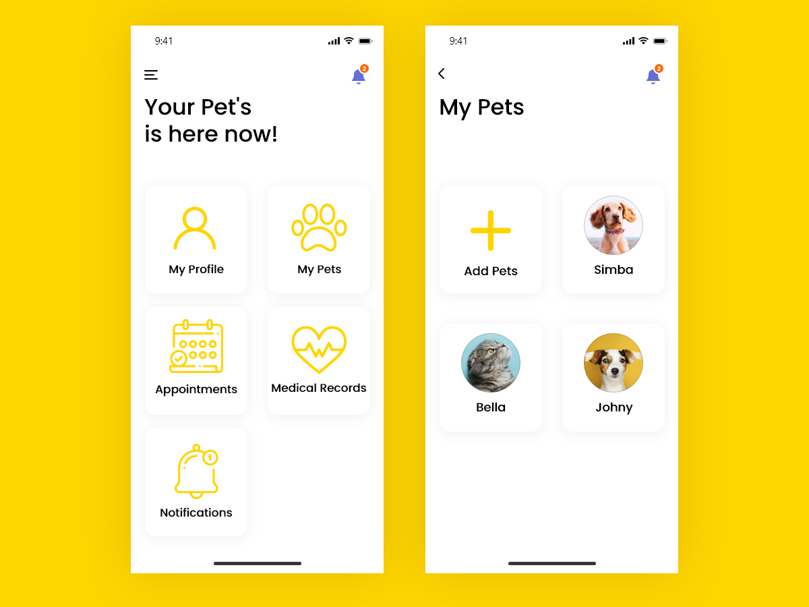

# 🐶 Flutter Pet Clinic App

This repo contains a Flutter based app inspired by the beautiful design made by *Atul Dhone*, shared on Uplabs, see: [Uplabs Pet Clinic](https://www.uplabs.com/posts/pet-clinic).

This three page-app contains small cards. Which are reusable through the whole app. If you are looking how to reuse widgets on multiple pages, definitely take a look.

## Getting Started 🚀

```shell
- Clone the repo
- Install the dependencies
- Run it
```

## Preview and Google Play



<!-- [](https://play.google.com/store/apps/details?id=com.interestinate.flutter_package_manager) -->

## Version history

| Version |       Date         |             Comments             |
| ------- | ------------------ | -------------------------------- |
| 1.0     | ~December 2019     | Initial release                  |


## Contributing

Feel welcome and free to submit issues, pull requests and features to this repo.

## Support me

I really like to make as much (free) beautiful Flutter apps, so you get inspired!
Hence you can support me by:

⭐️ this repo if you like it.

[](https://paypal.me/jwalhout?locale.x=nl_NL)

Thank you in advanced 👍

## More Flutter Apps

Want to see more beautiful app's make with Flutter, see [Interestinate](https://interestinate.com).

Or the following repo's:
- An Package Manager App: [Package Manager](https://github.com/LiveLikeCounter/Flutter-Package-Manager)
- An iOS focused Flutter App: [iSubscribe](https://github.com/LiveLikeCounter/Flutter-iSubscribe)
- A Food Delivery Flutter App: [Food Delivery](https://github.com/LiveLikeCounter/Flutter-Food-Delivery)
- A To Do App based on Flutter: [To Do](https://github.com/LiveLikeCounter/Flutter-Todolist)
- A Paypal Redesign made in Flutter: [Paypal Redesign](https://github.com/LiveLikeCounter/Flutter-Paypal-Redesign)

